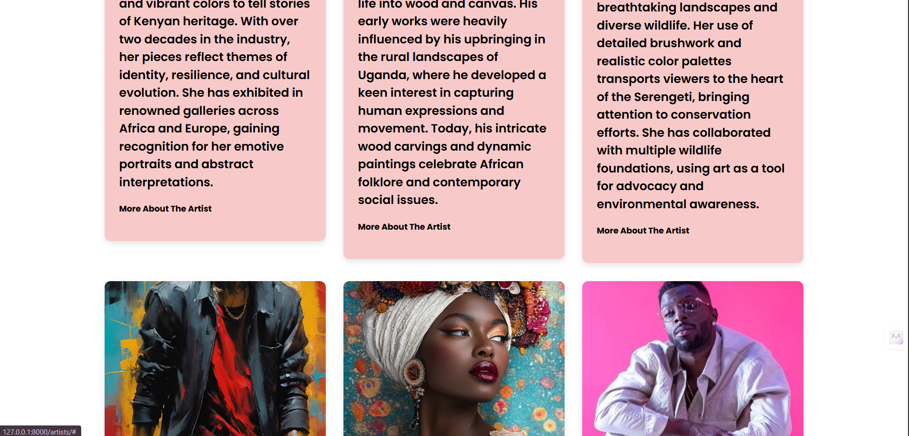
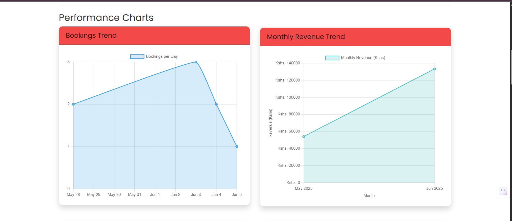

## First download the project to your computer/laptop and open it using either pycharm or VS Code, I'll explain using Pycharm Community Edition
## Open the terminal on Pycharm and run the project using the following command
## python manage.py runserver

## NB: BEFORE RUNNING THE PROJECT MAKE SURE YOU HAVE THE FOLLOWING DEPENDENCIES INSTALLED, IF NOT, USE THE FOLLOWING COMMANDS TO INSTALL THEM
             pip install django
             pip install requests
             pip install Pillow  
## After running the project on the terminal, this should be displayed on the browser.
 ## 

## You can choose to create you own superuser on the terminal by using this command
          python manage.py createsuperuser
    ## You will then be prompted to enter the username, email, and password.

     or you can use my login credentials, though it is not advisable:
     username: fatmahussein 
     pasword: fatmahussein

## Now, run the project and go to the browser and type this    
             ##  http://127.0.0.1:8000/                and this will be displayed        

## And on another tab type this
             ##  http://127.0.0.1:8000/admin        and this will be displayed

## And now you can login both on the frontend side and backend side using you credentials or mine.

## This is the homepage of the frontend side

## This is the layout of the backend side

## This is the about page of the frontend side 

## This is the Artists page that displays the artists 

## It gives a Bio about the artists

## You can click on "More about the Artist" to get to know the artist better and see the artworks made by that artist as shown below

## This is the artworks page that displays the artworks and their prices, availability and other details

## As you can see, at the top of that page, there is a cart where a customer can add the items they want to purchase
!
## It also displays the availability and the unavailability of an item. If an item is unavailable, the customer can click on the unavailable button and send a message to the art gallery to inquire about it as shown below.

## When you click on the cart, the following is displayed, that is after adding items to the cart

## You can add as many items as you want to the cart 

## When you click proceed to checkout, the order summary is displayed

## I also included a simulated payment system

## This is the exhibitions page where exhibitions are displayed for customers to book

## This is a real time exhibition system, it displays the number of slots available and the number of slots remaining for booking

## Once an exhibition has been fully booked, the booking button is disabled as shown below.

## This is the contact page

## This is the booking management page where a customer can see all the bookings they have made for events and exhibitions

## A customer can also choose to cancel an event/exhibition by clicking the cancel button

## And last but not least, the Reports page that displays reports and has a date filtering.

## And finally, this is the footer.

## THAT IS THE END OF THE EXPLANATION OF HOW THE FRONTEND WORKS.

## THE BACKEND WAS DEVELOPED USING PYTHON-DJANGO AND THIS IS HOW IT WORKS

